 

  

  

# 🏰 Deamon Days

Welcome to **Deamon Days**, an exciting 2D platformer HTML5 game where you must escape from demons and reclaim your castle! 👾⚔️

  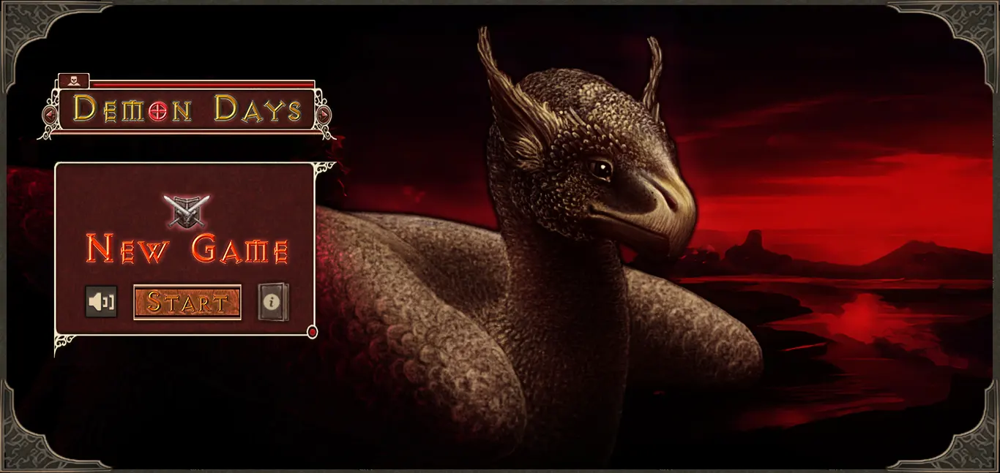

## 📜 Game Description

Demons have been attacking our kingdom for the past two years. As a result, we lost our kingdom...but our armies are ready for the final battle. Now, our time has come. We have to show our power to the demons. Your task is to escape from the demons and travel to your castle. 🏃‍♂️💨

- **Levels**: The game consists of 5 thrilling levels, each with unique environments and enemies. 🌍👹
- **Armor**: There are 3 special armor bodies available to the player, unlocking at each level. 🛡️✨
- **Objective**: Complete all 5 levels to win the game and reclaim your kingdom! 👑🏅

## 🎮 How to Play

1. **Jump**: Press the `space bar` or `up arrow key` to jump.
3. **Avoid Enemies**: Dodge the demons and obstacles to survive.
4. **Reach the Castle**: Travel through all levels and reach your castle to win.

## 🌟 Features

- 5 unique levels with varying environments.
- New enemies in each level.
- 3 different armor sets that unlock as you progress.
- Engaging and challenging gameplay.

## 🤺 Player Profiles

  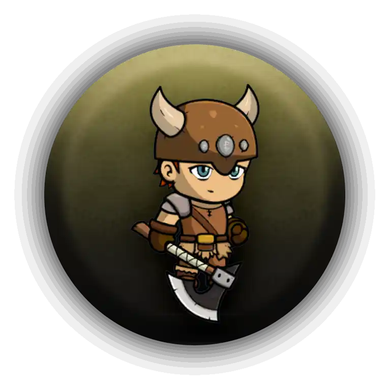
  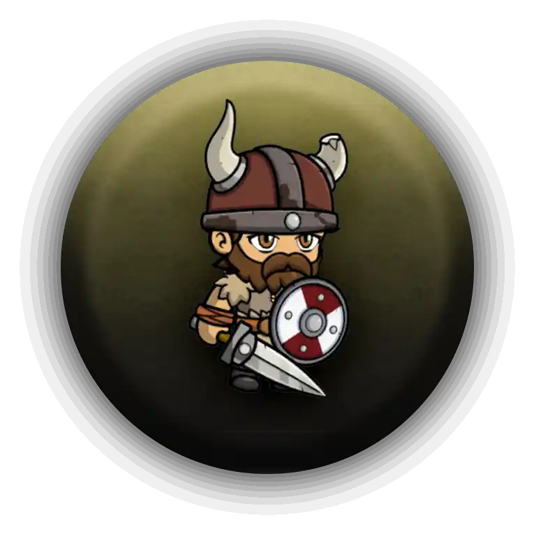
  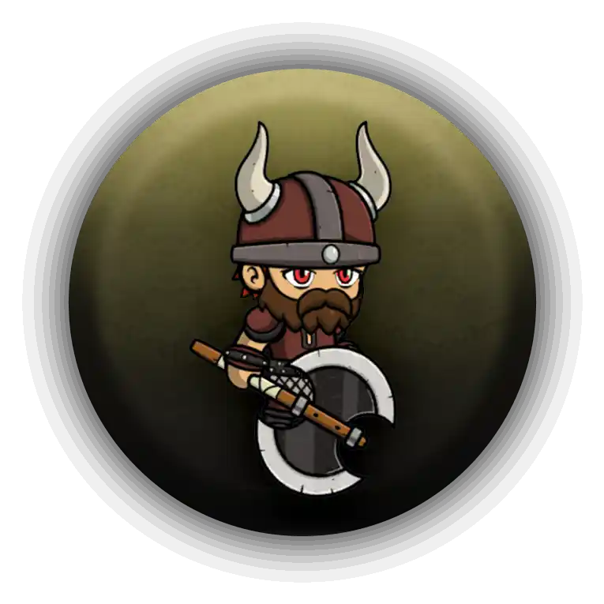

## 🔗 Play the Game Online

You can play Deamon Days directly in your browser by following this link🤩👉: [Play Deamon Days](https://dulanjayabhanu.github.io/DeamonDays/)

## 🛠️ Built With

- **HTML5**: For the game structure and layout.
- **CSS**: For styling and animations.
- **JavaScript**: For game logic and interactivity.

## 🎮 Gameplay

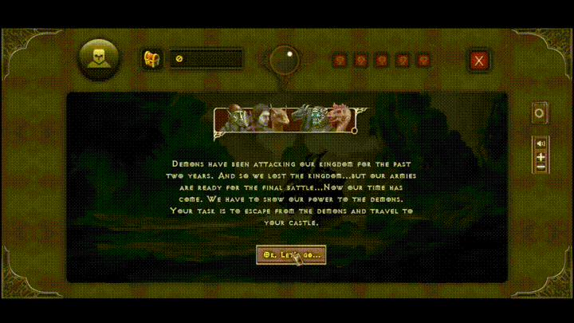  

## 📷 Screenshots

  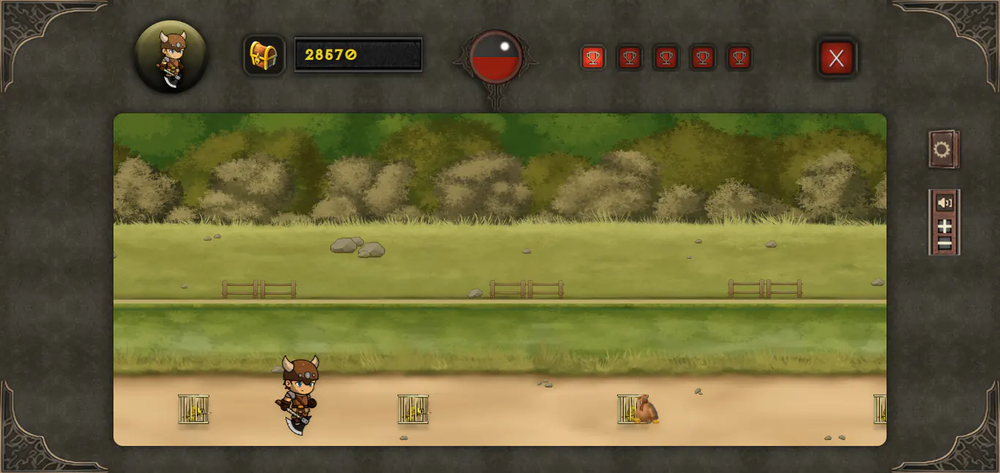
  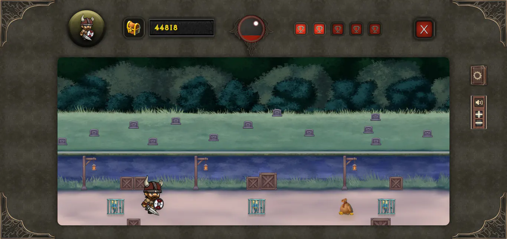
  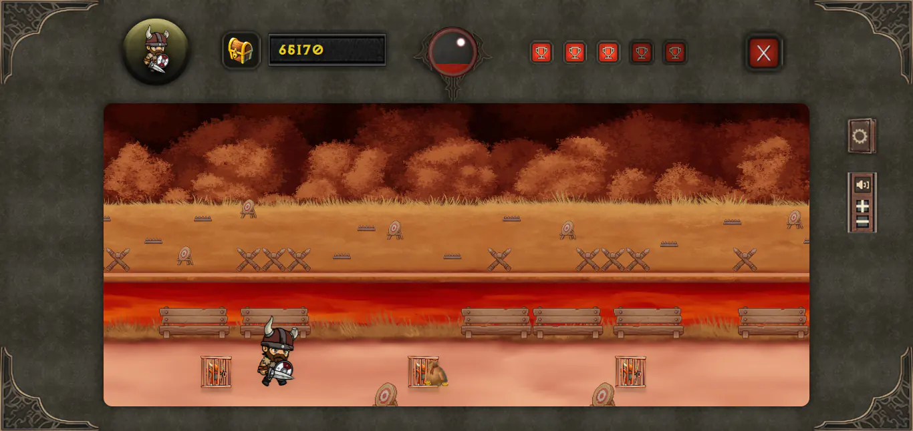
  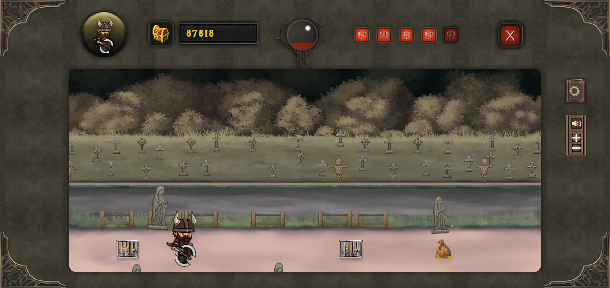
  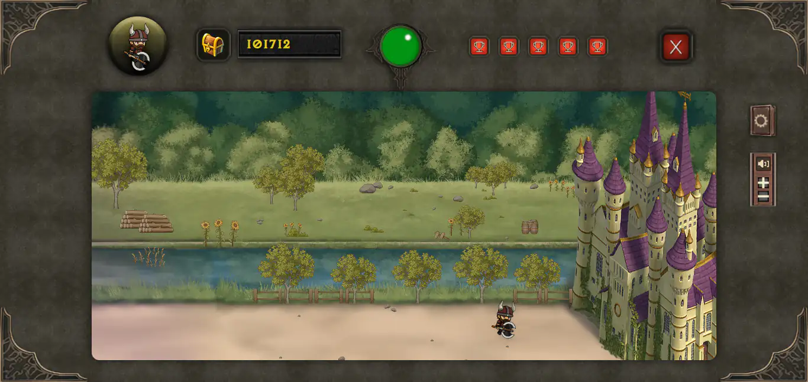
  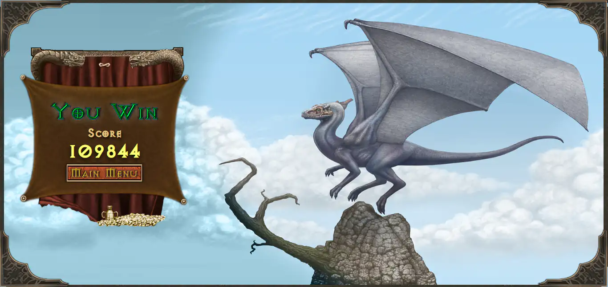

## 📣 Contributing

Contributions are welcome! If you have any suggestions or bug reports, please open an issue or submit a pull request. Let's make Deamon Days even better together! 💪

## 📄 License

This project is licensed under the MIT License. See the [LICENSE](LICENSE) file for details.

## 💬 Contact

If you have any questions or feedback, feel free to reach out:

- **Email**: [My Email](mailto:dulanjayawebs@gmail.com)
- **GitHub**: [Dulanjaya Bhanu](https://github.com/dulanjayabhanu)

---

Thanks for playing Deamon Days! Enjoy the game and reclaim your kingdom! 👑🚀
